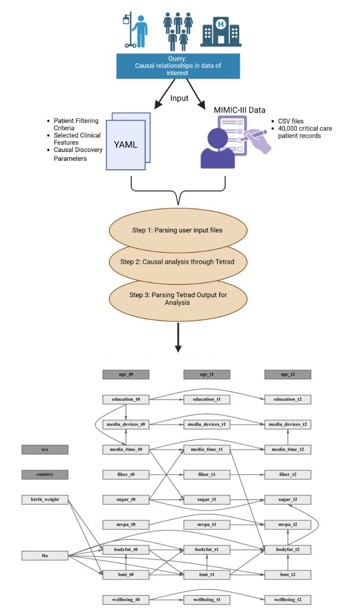
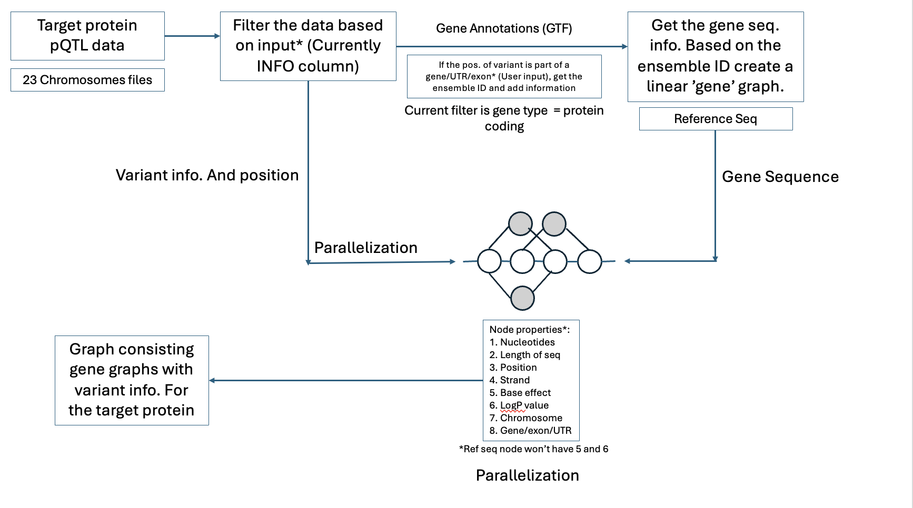
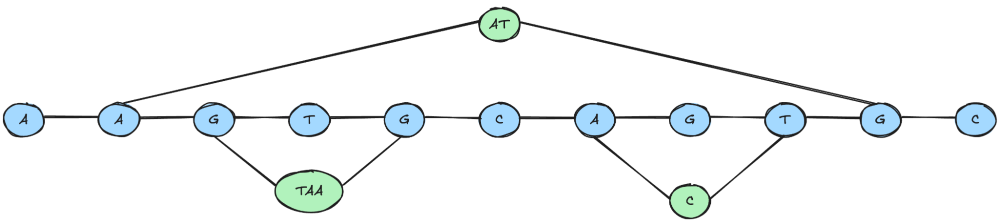
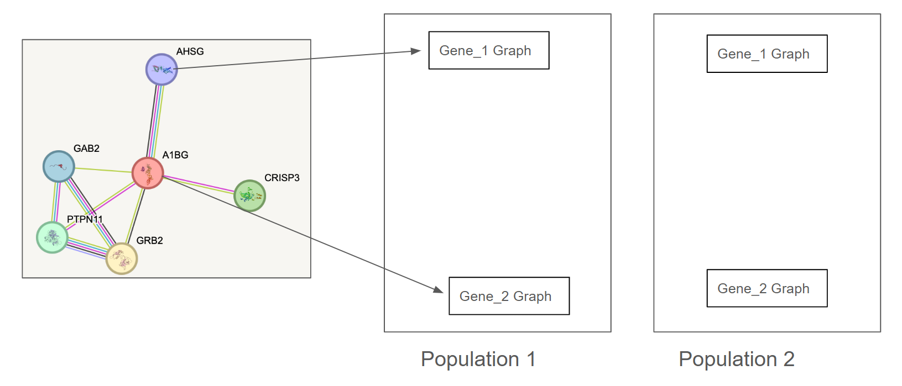
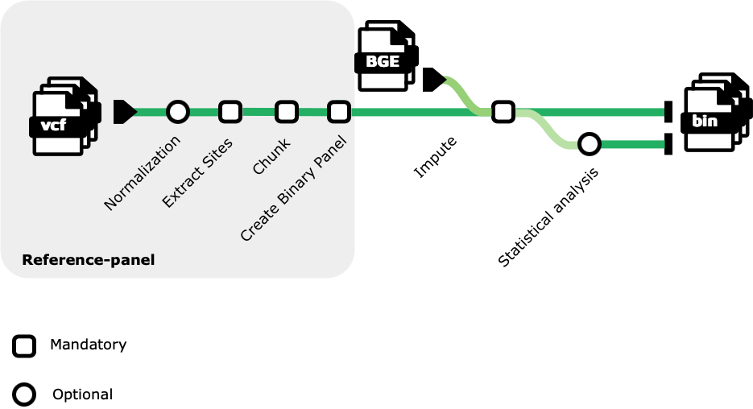

# 1. Introduction

## Overall Event

In March 2025, 34 scientists from the United States, Ireland, the United Kingdom, Switzerland, France, Germany, India, and Australia gathered in Pittsburgh, Pennsylvania and virtually for a collaborative biohackathon, hosted by DNAnexus and Carnegie Mellon University Libraries. The goal of the hackathon was to explore machine learning approaches for multimodal problems in computational biology using public datasets. Teams worked on the following innovative projects: applying machine learning techniques for clustering and similarity analysis of haplotypes; adapting the StructLMM framework to study Gene-Gene (GxG) interactions; creating a nextflow workflow for generating an imputation reference panel using large-scale cohort data; optimizing discovery of causal relationships in large electronic health record (EHR) datasets using the open source causal analysis software Tetrad; examining the evolution of a graph neural network in a Lenski-esque experiment; and developing tools and workflows for generating pathway intersection diagrams and graph-based analyses for multiomics data. All projects were dedicated to study the background genomic and environmental effects underlying complex genotype-phenotype relationships. Their objective was to set foundations for further studies on predicting complex phenotypic traits using integrative multi-omic and environmental analyses. All team projects are detailed below:

## 1.1 Clustering of haplotype matrices

Haplotype analysis plays a critical role in understanding genetic variation and evolutionary relationships. This study presents a computational pipeline on DNANexus that integrates haplotype data processing, ARG reconstruction, and machine learning techniques to explore genetic similarity and clustering among human samples. We used SHAPEIT2 phased variant call format (VCF) files from chromosomes 6, 8, 21, and 22 of The 1000 Genomes Project [@1000Genomes2015], converted the data into haplotype (HAP) format using Plink2 [@Chang2015; @PurcellChangPLINK] and applied preprocessing steps to standardize the input for ARG Needle. We also filtered chromosome 6 haplotypes for TNF and HLA-A variants and chromosome 8 for beta defensin, as TNF is one of the least variable genes in the human genome, while HLA-A and beta defensin are amongst the most variable. We obtained 61, 313, and 486 deduplicated biallelic SNPs for TNF, HLA-A, and beta-defensin, respectively. We then performed hierarchical clustering and similarity matrix calculation from these gene-specific haplotypes.

## 1.2 Cis and trans effects of haplotypes on rare variants penetrance with StructLMM adapted for Gene-Gene interaction analysis 

Gene-gene (GxG) interactions play a crucial role in understanding complex traits and diseases, yet their detection can be challenging due to statistical power limitations and confounding factors. Traditional genome-wide association studies (GWAS) primarily focus on single-locus effects, often overlooking interactions between genetic variants [@Cordell2009; @Hu2014]. Linear mixed models (LMM) have been widely used to account for population structure and relatedness, yet detecting GxG interactions remains underexplored [@Alamin2022]. StructLMM, an LMM introduced by [@Moore2018], has been successfully applied to gene-environment (GxE) interactions by incorporating structured environmental effects. 

Here, we adapt StructLMM to detect GxG interactions by leveraging local ancestry principal components (PCs), which capture variation at a haplotype level, as a proxy for environmental influences. Integrating ancestry-informed structure into the model allows the detection of GxG interactions while accounting for population heterogeneity. Such an approach provides a flexible and scalable framework for studying interactions across different genomic regions.

## 1.3 Generation of imputation panels for combined sequencing with biobank data

Blended Genome Exome (BGE) sequencing is an innovative approach developed by the Broad Institute that integrates low-pass whole genome sequencing (WGS) at approximately 3x coverage with 30x coverage whole exome sequencing (WES) on a unified sequencing platform [@DeFelice2024]. Unlike traditional genotyping arrays, BGE and low-pass WGS are not limited by predefined probe sets based on specific ancestral data, making them more inclusive for diverse populations. To obtain accurate variant calls for common variants across the genome, both BGE and low-pass WGS data require an imputation step, which relies on high-quality reference panels comprising large, ancestrally diverse samples. In this project, we aim to develop a Nextflow workflow [@DiTommaso2017] to construct imputation reference panels using extensive cohort datasets. As a proof of concept, we will deploy this workflow on the combined 1000 Genomes Project (1kGP) [@1000Genomes2015] and The Human Genome Diversity Project (HGDP) dataset [@CavalliSforza2005] made available through gnomAD [@Koenig2023].

## 1.4 Rapid Longitudinal Analysis of Public Health Data 

The increasing availability of electronic health records (EHRs) has revolutionized medical research, enabling large-scale data-driven insights into patient outcomes, disease progression, and treatment effectiveness. The MIMIC-III v1.4 (Medical Information Mart for Intensive Care) dataset is one of the most widely used publicly available ICU (Intensive Care Unit) datasets, containing data of over 40,000 patients [@Johnson2016MIMIC; @Johnson2016ScientificData; @Goldberger2000; @mimicWebsite]. Discovering causal relationships among clinical variables remains difficult. Working with raw EHR data presents several challenges that must be addressed for effective causal discovery: 1\) data fragmentation is a significant issue, as  of 27 interrelated tables MIMIC-III v1.4  require extensive preprocessing and integration; 2\) high dimensionality poses computational challenges, with thousands of variables that need to be processed, filtered, and analyzed to extract relevant causal relationships; 3\) the presence of noisy and missing data, due to irregular sampling and inconsistent documentation, which is common in real-world ICU settings; 4\) large-scale causal searches demand efficient data storage solutions and scalable computational resources. These data inconsistencies can introduce biases and reduce reliability of causal inference models.

## 1.5 Lenski-esque GNN Competition Trials

Genomic medicine seeks to uncover molecular mechanisms responsible for human diseases. Experimental identification of novel disease-associated genomic variants is expensive and time-consuming, often requiring extensive clinical studies. Large biological networks provide crucial information on complex relationships and interactions between biomolecules (e.g., genes or proteins) that underlie human diseases [@Barabasi2011]. Network-based computational methods provide an opportunity to efficiently model these complex relationships. In this study, we leveraged a graph neural network for disease-gene prioritization, geneDRAGGN [@altabaa2022geneDRAGNN], to perform a Lenski-esque experiment of “evolving” neural networks [@Lenski_2001]. We aimed at studying how the performance of neural networks change when constructed using different architectures (i.e., different combinations of hidden layers). We started with the original architecture of geneDRAGNN, then we iteratively “evolved” the neural network; in each iteration, we replaced individual layers of the network with various combinations of different layers. We aimed at selecting combinations of layers that have the highest impact on the neural network performance in discovery of novel disease-associated genes.

## 1.6 Population-Specific Multiomics Graph Analysis of ACE Protein Expression

Graph-based models offer a powerful approach for integrating multi-omics data to study gene regulation and protein expression. Recent advances in graph attention networks have demonstrated superior performance in cancer classification by effectively capturing complex molecular relationships [@alharbi2025]. Additionally, specialized applications like SSGATE have extended graph-based approaches to both single-cell and spatial multi-omics integration through dual-path graph attention auto-encoders, enabling more comprehensive analysis of cellular heterogeneity across different tissue types and sequencing technologies [@Lv2024]. This study presents a graph-based multi-omics framework that combines protein quantitative trait loci (pQTL) data, genome annotations (GTF files), and the GRCh38.p14 reference genome to map genetic variants affecting protein expression systematically [@Wang2024; @BiocoreCRG2021]. Our method constructs population-specific genome graphs, where subgraphs represent gene-level regulatory interactions, incorporating variant effects, statistical significance, and functional annotations. This structured representation enables the identification of cis- and trans-acting variants, uncovering regulatory differences across populations. By utilizing  graph-based modeling, our framework enhances the interpretation of genetic influences on protein expression, providing a scalable and integrative tool for multi-omics analysis, precision medicine, and systems biology.

# 2. Methods

## 2.1 Clustering of haplotype matrices

In this study, we developed a pipeline to analyze haplotype data from The 1000 Genomes Project ([https://ftp.1000genomes.ebi.ac.uk/vol1/ftp/release/20130502/](https://ftp.1000genomes.ebi.ac.uk/vol1/ftp/release/20130502/)) and apply machine learning techniques for clustering and similarity analysis. The methodology is outlined as follows:

**Step 1: Getting the Data**

We utilized phased variant call format (VCF) files for chromosomes 6, 8, 21, and 22 from The 1000 Genomes Project [@1000Genomes2015]. These VCF files were pre-phased using SHAPEIT2 /cite{Delaneau2013}. We selected chromosome 6 as it was used by prior groups and contains HLA and chromosome 8 as it contains beta defensin, a highly variable gene involved in microbial immune response, and chromosomes 21/22 due to their smaller sizes allowing for test processing.

**Step 2: Converting the Data**

The VCF files were converted into haplotype (HAP) format using Plink2 [@Chang2015; @PurcellChangPLINK].

**Step 3: Preprocessing the Data**

The HAP files were preprocessed with the following steps:

\- Space delimitation was enforced as required by ARG-Needle.  
\- In the .sample files, the IDs in columns ID\_1 and ID\_2 were made identical via copying ID\_2 to ID\_1.  
\- In the .haps file, unique IDs were assigned to variants with missing identifiers.  
\- The maximum allele length was set to 280 to standardize input data.  
\- Combining it with columns 2-4 from the original sample file to create a new SNP name/ID.  
\- Creating a new sample file with the modified format.

**Step 4: Generating ARGs**

To additionally prepare the data for generation of ARGs, both map and hap files needed to be modified so that positions to be arranged in monotonically increasing order by removing duplicated variants. In accordance with Zhang et al. [@Zhang2023], we performed ARG inference in parallel by dividing phased data into equal, non-overlapping chunks, and performing ARG inference on each chunk.

**Step 5: Clustering Analysis and Visualization**

Clustering/unsupervised machine learning pipelines were initially established using the ARGN file generated from the example SNP data described in the ARG-Needle \\{argneedle}. 

A tree visualization method for the ARGs that extends the efforts of prior hackathon teams was similarly initially produced from the ARG-Needle example SNP data using tskit.

We also ran clustering analysis (hierarchical clustering) on haplotype data for beta defensin, TNF alpha, and HLA-A genes from chromosomes 8 and 6 (both TNF alpha and HLA-A), respectively. We performed hierarchical clustering on input beta-defensin, TNF alpha, and HLA-A Plink hap files both by 1000 Genomes variant and individual using the seaborn clustmap function.

To characterize the haplotypes based on clinical significance, we used the vcf files to isolate biallelic SNPs, and then wrote code to use OpenCravat to annotate chromosomes with ClinVar ACMG annotation.

## 2.2 Cis and trans effects of haplotypes on rare variants penetrance with StructLMM adapted for Gene-Gene interaction analysis

Our approach adapts the StructLMM framework to enable the detection of gene-gene (GxG) interactions by replacing the traditional environment matrix with local ancestry PCs. This implementation allows us to model GxG interactions in an ancestry-aware manner, accounting for population-specific effects in the detection of interaction in any genomic regions of interest (cis or trans) while adjusting for confounders. 

The workflow consists of three primary steps:

1. **Defining the query variant**: A single nucleotide variant (SNV) with a strong effect on a phenotype is selected as the primary genetic factor of interest.  
2. **Extracting local ancestry PCs**: We compute principal components from local ancestry tracts within a genomic region of interest, which serve as structured covariates in the model.  
3. **Applying StructLMM for interaction testing**: The modified StructLMM framework models the interaction between the query SNV and other variants in the specified genomic region, while local ancestry PCs control for population-specific effects.

**Mathematical model:**   
The adapted model is structured as: 
$$
y = M\alpha + g\beta_0 + g\beta_1 + e + \epsilon
$$
where y represents the phenotype vector, containing the observed trait values for the individuals, M is a matrix of covariates that includes any relevant fixed effects or confounders, g denotes the genotype of the query single nucleotide variant (SNV), which is selected based on its strong effect on the phenotype of interest, 0 is the parameter associated with the main effect of query SNV on the phenotype, 

**Methods – Operation (how do people use it?)**

Users can follow the example use code provided in the GitHub repository ([https://github.com/collaborativebioinformatics/Cis\_and\_trans\_effects\_on\_variant\_penetrance?tab=readme-ov-file\#usage](https://github.com/collaborativebioinformatics/Cis_and_trans_effects_on_variant_penetrance?tab=readme-ov-file#usage)). The processes encoded consist of the following analyses:

Extracting local ancestry PCs and the single variant of interest:

* Variants from the genomic region of interest are filtered from a VCF file.  
* Quality control steps are applied. This includes missingness filtering, Hardy-Weinberg equilibrium checks, minimum allele frequency, maximum allele counts, variant IDs handling, and pruning out variant pairs of high correlation (\>0.2).   
* Principal components (PCs) are computed to summarise ancestry variation.  
* The processed SNV file was a two-column CSV with individual IDs and genotype values (0/1/2), and the PC file followed the standard output format from PCA tools (sample IDs \+ PC columns)

Running StructLMM for GxG analysis:

* The query SNV and local ancestry PCs are input into StructLMM.  
* The phenotype and additional covariates (e.g., plink format phenotype data) are included in the model.  
* Interaction effects are estimated, and statistical significance between the genetic variant and the PCs is provided to the user.

To evaluate the feasibility of our approach, we tested the modified StructLMM framework on the HAPNEST synthetic dataset [@Wharrie2022]. The full dataset includes genotypes for over one million individuals and 9 continuous phenotypic traits. For demonstration, we used the provided example subset comprising 600 individuals, Plink genotype files (.bed/.bim/.fam), local ancestry information (.sample file), and 9 phenotype files in .pheno format.

We selected a query SNV (chr6:32529369C\>A; rs554894601) and computed local ancestry principal components (PCs) from a nearby region (chr6:29944513–29945558). This region and variant were chosen as illustrative input, although the region overlaps the Human gene HLA and the variant is intronic with no known clinical significance. This setup allows us to validate the tool’s operation in a realistic workflow involving real variant data, regional ancestry structure, and phenotypic traits. From the nine available phenotypes, we selected phenotype 1 (.pheno1) with heritability of 0.03 and polygenicity of 0.1 and incorporated it as a binary trait, labeled Phenotype(binary) [@Wharrie2022].

The StructLMM pipeline completed successfully, with the following output:

| P-value | N (samples) | PCs used | Phenotype | Mean | Std Dev |
| ----- | ----- | ----- | ----- | ----- | ----- |
| 0.861 | 600 | 5 | Phenotype(binary) | 0.502 | 0.500 |

No significant interaction was observed between the SNV and the local ancestry PCs (p \= 0.86). This might be explained by the small sample size (600 individuals) and the binary nature of the phenotype (which reduces statistical power). However, this test confirms that the framework runs as expected, ingests ancestry-informed covariates, and returns results showing the statistical significance of the tested interaction, the number of PCs used (generated from the preprocessing step), and the phenotype distribution (mean and standard deviation).

## 2.3 Generation of imputation panels for combined sequencing with biobank data

***Implementation***

Building upon [GLIMPSE2's tutorial](https://odelaneau.github.io/GLIMPSE/docs/tutorials/getting_started/) [@Rubinacci2021; @Rubinacci2023; @GLIMPSE], which provides bash script snippets for generating reference panels from a single chromosome  
(specifically, chromosome 22 of The 1000 Genomes Project b38 data from the EBI FTP site [@1000Genomes2015]), we developed a scalable Nextflow pipeline capable of processing all chromosomes in our dataset. Due to the complexities associated with chromosome X, it was excluded from this project.

***Dataset***

The pipeline utilizes the combined, phased HGDP+1kGP haplotype dataset from the HGDP and the 1000 Genomes Project, available in the gnomAD public cloud folders that can be accessed from either Google Cloud Platform (gs://gcp-public-data--gnomad/resources/hgdp\_1kg/phased\_haplotypes\_v2) or Amazon Web Services (s3://gnomad-public-us-east-1/resources/hgdp\_1kg/phased\_haplotypes\_v2  
). The dataset is made up of 4091 subjects from diverse ancestries.

The pipeline comprises four main steps:

1. Conversion of multiallelic sites: Transform all multiallelic sites into biallelic sites, retaining both single nucleotide polymorphisms (SNPs) and insertions/deletions (indels)  
2. Extraction of site information: Extract site information for the entire cohort ignoring specific genotype calls  
3. Chunking reference data: Divide the reference data using GLIMPSE2\_chunk and prior mapping information provided in the GLIMPSE2 repository  
4. Splitting reference chromosomes: Segment the reference chromosomes into binary chunks for all chromosomes

The software tools employed in this pipeline include [bcftools](https://samtools.github.io/bcftools/) [@Danecek2021; @bcftools], [GLIMPSE2](https://odelaneau.github.io/GLIMPSE/) [@Rubinacci2021; @Rubinacci2022; @GLIMPSE], [Nextflow](https://github.com/nextflow-io/nextflow) [@DiTommaso2017; @nextflow], and [Docker](https://github.com/docker) [@Merkel2014; @docker].

***Operation***  

Users can execute the Nextflow pipeline on their chosen phased, WGS dataset to create a customized reference panel. The pipeline's modular design facilitates straightforward integration into existing workflows, enhancing its adaptability for various research applications. 

## 2.4 Rapid Longitudinal Analysis of Public Health Data 

### **Implementation Details**

Our causal discovery pipeline consists of three major steps, with each step contributes to the larger goal of automating causal inference from electronic health records (EHRs), ensuring efficient preprocessing, scalable computation, & meaningful insights into ICU patient outcomes.

1. Parsing User Input YAML File  
2. Running Tetrad [@Ramsey2018] on Preprocessed Data  
3. Visualizing Tetrad Output   
   

**Step1: Parsing User Input YAML File**  

*This step ensures that causal discovery is performed on a relevant, well-structured dataset, reducing noise and improving interpretability.*

Input: 

* A YAML configuration file that includes:  
  * Patient Filtering Criteria (e.g., diagnosis codes, admission type)  
  * Selected Clinical Features (e.g., lab results, vital signs, microbiological events)  
  * Causal Discovery Parameters (e.g., algorithm selection, conditional independence test)  
* An SQLite database that contains the MIMIC-III v1.4 CareVue subset dataset [@johnson2022mimic], containing patient data spread across 27 relational tables.

Processing:

* Load the YAML file and extract the user-defined filters.  
* Query the relevant MIMIC-III v1.4 tables (e.g., DIAGNOSES\_ICD, LABEVENTS, MICROBIOLOGYEVENTS) to extract data matching the filtering criteria.  
* Join multiple tables to create a cohort dataset, ensuring patient records are structured appropriately for causal analysis.  
* Convert categorical variables into appropriate numerical representations (e.g., encoding comorbidities, ICU transfers).  
* Store the preprocessed dataset in an SQL database for efficient querying and downstream analysis.

Output: A cleaned, preprocessed dataset filtered based on user criteria, ready for causal discovery & a SQL database containing structured, efficiently retrievable patient records.

**Step2: Running Tetrad on Preprocessed Data**  

*This step applies advanced statistical and machine learning techniques to uncover potential causal relationships in ICU patient data, moving beyond correlation-based analyses.*

Input:

* The preprocessed dataset(s) from Step1  
* User-defined causal discovery parameters (e.g., choice of algorithm, significance thresholds).

Processing:

* Convert the structured dataset into a format compatible with Tetrad, a causal discovery tool.  
* Run the selected causal discovery algorithm (e.g., PC Algorithm, FCI, GES) on the dataset.  
* Generate graphical causal models (DAGs) representing inferred causal relationships among variables.  
* Store Tetrad’s raw output, including adjacency matrices, edge confidence scores, and causal directionality data.

Output: Causal graphs (DAGs) illustrating the relationships between clinical variables & a tabular output listing causal dependencies, effect sizes, and statistical confidence measures.

**Step3: Parsing Tetrad Output for Analysis**  

*This step ensures that the discovered causal relationships are accessible, interpretable, and useful for clinical decision-making, enabling a data-driven approach to patient care.*

Input: 

* Tetrad output file(s) (causal graphs, adjacency matrices, tabular causal relationships) from Step2  
* Original dataset for contextual mapping of identified causal relationships

Processing:

* Parse adjacency matrices to extract variable relationships and confidence scores.  
* Convert the causal graph into a human-readable format (e.g., directed acyclic graph visualization).  
* Aggregate findings to identify key drivers of patient outcomes (e.g., mortality, readmission risk).  
* Generate summary statistics and reports for clinical interpretation.

Output: Graphical representations of causal relationships between clinical features along with tabular summaries highlighting statistically significant causal dependencies.

How to use it?

| *Open a bash window and execute the following commands to run the project: \#\!/bin/bash \# Exit immediately if a command exits with a non-zero status set \-e \# Input to this step: User\_input\_yaml.txt echo "Step 1: Generating example user input..." Rscript GenerateExampleUserInput.r echo "Creating SQLite database..." bash Create\_SQLite\_DB.sh echo "Parsing user input and filtering dataset tables..." Rscript ParseUserInput.r \# Input to this step (Output from previous step): Knowledge.txt echo "Step 2: Running Tetrad with the parsed input..." Rscript Run\_tetrad\_from\_yaml.r echo "Step 3: Visualizing the Tetrad output..." Rscript s\_visualize\_tetrad\_output\_RS\_AMP.R echo " Done\!"* |
| :---- |

 

 

![**Plot of Tetrad-discovered causal relationships from
MIMIC-III CareVue subset** [@johnson2022mimic]](./image2.jpg)

## 2.5 Lenski-esque GNN Competition Trials

During the hackathon, we used protein-protein interaction data along with gene ontology, tissue-specific gene expression, and mutation rate from public databases: The Human Protein Atlas [@ponten2008human], Genomic Data Commons [@heath2021nci] and the STRING database [@szklarczyk2021string]. In addition, we used disease-association data from the DisGeNET database [@pinero2020disgenet] as positive-label data for our training set.

We used the data preprocessing pipeline from geneGRAGNN, which includes the following steps:

1. *import\_dgn.py* \- provides gene-disease association scores and evidence index scores from DisGeNET  
2. *import\_gdc.py* \- provide node features (mutation rates for a specific disease) from the National Institute of Health Genomic Data Commons data   
3. *import\_hpa.py* \- provide node features (gene and RNA expression) from the Human Protein Atlas  
4. *import\_string.py* \- provides protein-protein interactions from the STRING database  
5. *create\_node2vec\_embeddings.py* \- creates graph embeddings using node2vec  
6. *main\_data\_pipeline.ipynb* \- generates the final input file for geneDRAGNN

We trained a suite of networks of two types: the first was the original architecture of geneDRAGNN [@geneDRAGNN]; the second was the original architecture of geneDRAGNN with additional layers implemented in the PyTorch Geometric library [@[Fey\_Fast\_Graph\_Representation\_2019], such as:

* conv.GCNConv \- the simplest GNN layer  
* conv.SAGEConv \- leverages node feature information (e.g., text attributes) to efficiently generate node embeddings for previously unseen data  
* conv.GATConv \- enables (implicitly) specifying different weights to different nodes in a neighborhood, by stacking layers in which nodes are able to attend over their neighborhoods' features,  
* conv.TransformerConv \- incorporates feature and label propagation at both training and inference time  
* conv.HGTConv \- designed for heterogeneous graphs

Following the methods and parameters outlined in geneGRAGNN, we extracted features from our input data using node2vec and created a graph network with the positive-unlabeled nodes [shi2021maskedlabelpredictionunified].

**Methods – Operation (how do people use it?)** 

For scripts to install geneDRAGNN, set up the environment and run the experiments, see [https://github.com/collaborativebioinformatics/LenskAI](https://github.com/collaborativebioinformatics/LenskAI). We illustrate the modifications to the geneDRAGNN code in the README file. We provide the *models\_hackathon.py* and *train\_gnn\_model\_hackathon.py* scripts that we used for the experiments.

**Methods – Extension (how can people extend it?)**

Everyone is welcome to clone the repository and build upon the project, for example, to extend the experiments of evolving networks to include different combinations of layers. Furthermore, it is worth examining how the choice of the input data impacts the model performance. In other words, we hypothesize that neural networks can benefit from additional input data, however, it is often unclear what information is actually extracted from the data. Therefore, this project might additionally include training the neural network with several biological datasets of varying size and biological information, followed by using an explainable AI (XAI) method. Such XAI methods compute explanation subgraphs that show the impact of network patterns and node features on the output. With explanation subgraphs, it might be possible to examine each experiment more closely, hence explaining what biological information is leveraged by the neural network while making predictions.

## 2.6 Population-Specific Multiomics Graph Analysis of ACE Protein Expression

### **Methods – Implementation (how did you build it?)**

This workflow aims to generate population-specific genome graphs that highlight the genetic variants influencing the expression of a target protein. These graphs are constructed based on pQTL (protein quantitative trait loci) data and genomic annotations, ultimately representing how different genetic variations impact protein expression across populations. We systematically analyze chromosome-specific variants affecting ACE protein expression using protein quantitative trait loci (pQTL) data [@Sun2023]. We integrate this data with the latest human reference genome (GRCh38.p14) [@gencodegenes_human] and functional genomic annotations from GTF files to pinpoint coding and regulatory variants . To visualize population-specific genetic architectures, we construct disconnected genome graphs, where nodes represent genetic variants with key attributes such as effect size (Beta), p-value, and functional annotations. By comparing these graphs across populations, we aim to uncover distinct genetic influences on ACE protein expression, providing insights into population-specific regulatory mechanisms and their implications in precision medicine. This framework serves as a scalable approach for multi-omics graph analysis in complex trait studies.  We build the workflow as follows:

**Target Protein pQTL Data Processing** The workflow begins with the processing of protein quantitative trait loci (pQTL) data for the target protein. This dataset consists of chromosome-specific variant files, one for each of the 23 chromosomes. These files are used to identify genetic variants associated with the target protein. The variants are extracted and organized by chromosome to facilitate downstream filtering and analysis. This step ensures that all relevant genetic information for the target protein is included in the pipeline.

**Filtering Variants Based on User Input** The extracted pQTL data is filtered based on user-defined criteria, which currently involves parsing the INFO column of the pQTL dataset. The filtering criteria can be customized to include specific variant properties, such as allele frequency, effect size, or functional annotations. This step reduces the dataset to variants that meet user-specified thresholds, ensuring that only biologically or clinically relevant variants are included in subsequent analyses.

**Gene Annotations and Variant Mapping** Gene annotation data in GTF (General Transfer Format) is used to map filtered variants to their corresponding genomic features. For each variant, its position is checked against annotated regions such as genes, untranslated regions (UTRs), and exons. If a variant falls within one of these regions, additional information such as the Ensembl gene ID is retrieved and linked to the variant. The current implementation focuses on protein-coding genes, but this can be extended to other gene types based on user input. This step ensures accurate mapping of variants to functional genomic elements.  We use the Entrez module in BioPython for this step. [@Cock2009; @Biopython2025; @BiopythonEntrez2025]

**Gene Sequence Extraction** The reference sequence for each gene identified in the previous step is retrieved using its Ensembl gene ID. This sequence forms the basis for constructing a linear "gene graph." The gene graph represents the reference sequence as a series of connected nodes, where each node corresponds to a segment of the sequence. This step provides a foundational structure for integrating variant information into the graph.

**Variant Integration into Gene Graphs** Variants mapped to genes are integrated into their respective gene graphs by modifying or adding nodes and edges. Each node in the graph stores metadata such as nucleotide sequence, length, position, strand orientation, chromosome number, and genomic feature type (e.g., gene, exon, UTR). For variant nodes, additional properties such as base effect (e.g., SNPs, insertions, deletions) and statistical significance (e.g., logP value) are also stored. Reference sequence nodes do not include these additional properties. All variants are connected to both upstream and downstream nodes in the graph to ensure continuity.

**Construction of Target Protein Genome Graph** The final step involves combining all gene graphs associated with the target protein into a comprehensive genome graph. This graph incorporates both reference sequences and variant information for all relevant genes across chromosomes. The resulting structure provides a holistic view of genetic variation affecting the target protein and enables downstream analyses such as path traversal or visualization of alternative haplotypes.

**Parallelization** To optimize performance, especially when processing large datasets or multiple chromosomes simultaneously, parallelization is explored within this workflow. Computationally intensive steps such as filtering variants or constructing gene graphs can be parallelized across multiple processors or distributed computing environments. This ensures scalability and efficiency when handling high-throughput sequencing data. We use PyTorch in some elements of the pipeline which gives GPU parallelization. [@pytorch2025].

### **Methods – Operation (how do people use it?)**

Refer to the GitHub repository ([https://github.com/collaborativebioinformatics/Multiomic\_graph](https://github.com/collaborativebioinformatics/Multiomic_graph)) for instructions on data processing. This will generate a .tsv file that will be used in the graph generation step. 

Once the filtered tab separated value (.tsv) file is created, utilize the graph.py executable script to generate your graphs. Provide the script with the variant .tsv file, along with an email to use for NCBI API calls. Outputs will be stored in an “outputs” folder which contains a compressed PyTorch data file, and a text file indicating the sequence of the gene graphs. To open the compressed file, utilize gzip and make sure to set “weights\_only=False” when calling torch.load(). 

  

![**Protein network (from [@GENengnews2025])**](./image5.png)

![**Gene variants in population (from [@statnews2016])**](./image6.png) 
 

![**Population gene graphs (from [@nihpangenome2023])**](./image7.png) 
 
 
 
 

# 3. Discussion and Future Directions 

## 3.1 Clustering of haplotype matrices

Although we were able to establish methods to perform clustering and annotation analysis of example ARG-Needle data, a sticking point in our overall pipeline development was the difficulty of successfully producing ARGN files from the chromosome-level The 1000 Genomes Project [@1000Genomes2015].

One potential cause of the problems we’ve been experiencing with ARG-Needle in this project could be because we’ve been trying to work with a highly diverse population from The 1000 Genomes Project. ARG construction with ARG-Needle relies on threading of samples into the graph based on similarity to other individuals, but ARG-Needle was primarily tested on samples from the UK Biobank, representing a highly homogenous population. For our purposes, selecting a more homogenous subpopulation, such as a British European or Dai Chinese subpopulation, from The 1000 Genomes Project data on which to run ARG construction could work better. Additional potential approaches to this issue could include using alternative tools like GenoTools or generating brute-force similarity matrices from haplotype data.

While we also examined clusters of shared variants in two genes known to be highly variable (beta-defensin and HLA-A), future directions should further expand this analysis to more known highly variable genes, and should also consider including linkage disequilibrium analysis. Such analysis could identify linked blocks of variants useful for haplotype determination. Identifying linkage blocks based on different adjacent variant linkage thresholds, in addition to consideration of linkage block diversity amongst population genomic data, may provide data useful for downstream machine learning identification of haplotype clusters corresponding to particular subpopulations.

## 3.2 Cis and trans effects of haplotypes on rare variants penetrance with StructLMM adapted for Gene-Gene interaction analysis 

Detecting GxG interactions remains one of the more elusive goals in statistical genetics. While single-variant models have matured significantly through GWAS, extending these frameworks to capture the combinatorial effects of interacting loci has proven difficult, often due to confounding and subtle effect sizes. In this project, we adapted the StructLMM framework, originally developed for structured gene-environment (GxE) interaction analysis, to explore GxG interactions, using local ancestry principal components (PCs) as structured proxies for haplotypic variation.

This choice is motivated by the biological observation that genetic interactions can occur in cis (nearby variants within the same regulatory or linkage context) and trans (distal interactions across loci or chromosomes). By extracting ancestry PCs from a genomic region of interest, we implicitly summarize ancestry and local haplotypic structure to capture the combined influence of linked variants that may modulate a focal SNV. In essence, these PCs allow us to test whether the penetrance of a specific variant is modified by its surrounding genetic environment.

Our application of the method to a synthetic dataset from HAPNEST [@Wharrie2022] served as a proof-of-concept. While the result (p \= 0.86) did not suggest any statistically significant interaction between the query SNV and the regional ancestry PCs, this is not a failure of the model per se. 

The value of this demonstrated framework lies in its scalability and flexibility. It provides a path to exploring GxG effects, particularly in cohorts with admixed ancestries or rich regional genomic structures. With future refinements, the method can serve as a practical tool for uncovering complex genetic interactions in human traits. Adapting the method and validating its application to large-scale biobanks, such as the UK Biobank ([https://www.ukbiobank.ac.uk/](https://www.ukbiobank.ac.uk/)) or All of Us Research Program ([https://allofus.nih.gov/](https://allofus.nih.gov/)) or disease-specific studies will determine its real-world performance. 

Several avenues exist for extending and refining this work. One avenue is to scale the analysis to larger sample sizes, ideally using the full HAPNEST dataset or other real-world biobank-scale cohorts with diverse ancestry backgrounds. Increased statistical power would make it feasible to detect subtler interaction effects and evaluate whether the framework can recover known or simulated GxG interactions.

Second, the current implementation treats local ancestry PCs as an abstract structured covariate. Future work could compare this to explicit haplotype-based models, such as those incorporating phased haplotypes, to assess whether PCs effectively approximate the local genetic background or lose signal due to dimensionality reduction.

Third, expanding the model to accommodate categorical or multi-class phenotypes and testing robustness across different phenotype types (e.g., quantitative vs. binary) could further generalize the tool’s applicability. In this initial test, only one phenotype was used; running across all nine HAPNEST traits could reveal more favorable settings for detecting interactions.

From a software perspective, it would also be valuable to package the code into a reproducible module or wrapper to allow users to plug in query variants and regions without reworking preprocessing steps. As part of this, the selection of PCs could be automated rather than separated. 

## 3.3 Generation of imputation panels for combined sequencing with biobank data

  

The workflow has been successfully tested on local systems, on-premises HPC systems, DNANexus, and Google Cloud Platform (GCP). On DNANexus, the workflow takes \<1 hour to create the final binary reference files for our example dataset using 22 concurrent operators on 4 core virtual machines (mem2\_ssd1\_v2\_x4). The compute cost of generating the reference panel was USD $1.50. 

Future directions include inclusion of chrX into the workflow, adding additional platforms (AWS, Azure), and providing the ability to work on additional datasets. These advancements would further augment the pipeline's robustness and utility in genomic research. As Biobank scale datasets continue to grow, (UK Biobank, All of Us, Mexico City Biobank, Our Future Health, FinnGen, Japan Biobank, and others), the feasibility of merging the raw data between these resources may be low, but each could potentially provide imputations panels for public use. This workflow could facilitate the generation of those panels.

## 3.4 Rapid Longitudinal Analysis of Public Health Data 

Using the MIMIC-III v1.4 dataset [@Johnson2016MIMIC; @Johnson2016ScientificData; @Goldberger2000; @mimicWebsite], 87 causal relationships were found. The relations along with their interpretations are mentioned in the appendix. The primary outcome of our methodology was a significant reduction in Tetrad computation time [@Ramsey2018]. By leveraging user input, the pipeline efficiently filters large datasets, extracting only the necessary rows and columns required for analysis. This preprocessing step drastically reduces the data size before running Tetrad, optimizing computational efficiency. Furthermore, post-filtering, Tetrad is executed in parallel across multiple data chunks, allowing for faster processing and better scalability. The pipeline utilizes multiple features and clinical outcomes from Electronic Medical Records (EMR) to intelligently guide the execution of Tetrad, ensuring that causal inference is both data-driven and contextually relevant. The methodology significantly reduces the computational burden of running Tetrad by filtering the dataset based on user-defined criteria. This ensures that only relevant subsets of data are processed, making causal inference more efficient. 

By splitting the dataset into manageable chunks and executing Tetrad in parallel, the methodology leverages efficient processing, reducing execution time and improving scalability for large datasets. 

The use of Electronic Medical Records (EMR) features and outcomes guides data selection, ensuring that the input data remains clinically meaningful while eliminating irrelevant noise.

The approach is highly adaptable, allowing it to be extended to other large-scale datasets, including biological data (e.g., SNPs, gene expression), without major modifications. Future improvements can integrate dimensionality reduction techniques like PCA, which could further compress large datasets while preserving essential patterns, thus improving computational efficiency.

This pipeline has significant potential for expansion and adaptation to newer challenges and datasets. Some key areas for future development include:

* The methodology could be extended to analyze biological datasets, such as single nucleotide polymorphisms (SNPs) and gene expression data. By incorporating statistical models and causal inference techniques, we could explore genetic associations and uncover meaningful biological relationships.  
* Implementing Principal Component Analysis (PCA) / Uniform Manifold Approximation and Projection (UMAP) or other feature selection methods could help optimize performance by reducing the dataset size while preserving key information (This can be taken from the output of other team). Automated hyperparameter tuning and scalable database queries could further enhance efficiency.  
* The pipeline can be modified to handle different domains, such as electronic health records (EHRs), population health studies, or clinical trial data. Extending support for multi-modal datasets (e.g., combining text, images, and structured data) would make the pipeline more versatile.  
* Adding predictive modeling techniques (e.g., random forests, deep learning, or Bayesian inference) could enhance its ability to identify patterns and forecast outcomes. Time-series modeling could be integrated for longitudinal health data analysis.  
* Developing a graphical user interface (GUI) or API would make the pipeline accessible to researchers with minimal coding expertise. Integration with R Shiny or Jupyter Notebooks could enable interactive exploration of results.

## 3.5 Lenski-esque GNN Competition Trials

Large biological networks such as protein-protein interaction networks or disease-gene association networks provide essential information about relationships and interactions between biomolecules. With the growing amount of such data, new bioinformatics approaches are needed. We conducted a project at the CMU / DNAnexus Hackathon 2025 to examine how we can leverage graph neural networks to extract biological insights from network-type of data. During the hackathon we aimed at training and "evolving" a graph neural network geneDRAGGN for disease gene prioritization using public protein-protein interaction data (STRING database) and disease-gene association data (DisGeNET database). Our results suggest that imputing such large biological networks into graph neural networks is challenging due to computational requirements of such algorithms despite using an efficient cloud infrastructure. Our preliminary results present a unique set of top 10 genes that predict worse disease outcomes in lung cancer patients.

Looking forward, we plan to explore possible solutions to the challenge of imputing large biological networks into graph neural networks. In addition, we emphasize the importance of developing algorithms for reducing the size of network files so that the computation is more memory-efficient, yet no significant biological information is neglected or removed.

## 3.6 Population-Specific Multiomics Graph Analysis of ACE Protein Expression

This workflow aims to generate population-specific genome graphs that highlight the genetic variants influencing the expression of a target protein. These graphs are constructed based on pQTL (protein quantitative trait loci) data and genomic annotations, ultimately representing how different genetic variations impact protein expression across populations.

Advancements in multi-omics analysis have significantly enhanced our ability to investigate the genetic and molecular mechanisms underlying complex traits and diseases ([@Hasin2017]; [@Misra2019]). Protein quantitative trait loci (pQTL) studies play a crucial role in linking genetic variation to protein expression, providing key insights into gene regulation at the protein level [@Suhre2011; @Sun2018]. However, traditional variant mapping approaches often fail to account for population-specific genetic architectures and the broader functional context of these variations [@Wojcik2019;@Garrison2018]. 

Previous studies have demonstrated that pQTLs can influence protein expression through multiple mechanisms, including transcriptional regulation, mRNA stability, and post-translational modifications [@Suhre2011; @Chick2016]. However, mapping these associations accurately remains challenging due to reference genome biases, the presence of highly polymorphic regions, and population-level genetic diversity [@Sun2018]. While graph-based genome representations have been proposed to mitigate mapping errors and improve variant calling in diverse populations [@Garrison2018; @Eizenga2020], there is still a critical need for scalable multi-omics approaches that integrate pQTL data with functional genomic annotations to identify population-specific regulatory networks.

Here, we present a multi-omics graph-based framework for studying ACE protein expression across Asian and African populations. Our approach integrates pQTL data, the latest human reference genome (GRCh38.p14), and functional genomic annotations (GTF files) to construct population-specific genome graphs. Each subgraph represents gene-level regulatory interactions, incorporating chromosome-specific variant effects, beta coefficients, p-values, and functional annotations. By leveraging graph-based modeling, we aim to uncover both shared and population-specific influences on ACE protein regulation, ultimately providing novel insights into genetic variation and its impact on protein expression.

This framework not only enhances the accuracy of variant interpretation but also establishes a scalable method for multi-omics pathway analysis, facilitating discoveries in precision medicine and systems biology.

Future work will focus on parallelizing graph generation to distribute construction across multiple genes, thereby accelerating processing for large datasets. We plan to implement advanced filtering options to allow selection by gene lists, features, gene types, and genomic coordinates to produce problem-specific graphs. Additionally, integrating Graph Neural Networks (GNNs) for variant annotation and downstream analysis will be pursued, along with optimizing computational efficiency to ensure scalability for large-scale genomic studies.

# 4. Data and Software Availability

All code and required software stacks are provided in the following GitHub repositories, which may include additional links to data repositories and Jupyter Notebooks.

If you or your colleagues are interested in collaborating on these or similar projects in a hackathon or professional setting, please contact ben.busby@gmail.com. If you have technical questions or issues, please put an issue into one of the GitHub repositories listed below.

4.1 Clustering of haplotype matrices: [https://github.com/collaborativebioinformatics/Haplotype\_matrix\_clustering](https://github.com/collaborativebioinformatics/Haplotype_matrix_clustering)

4.2 Cis and trans effects of haplotypes on rare variants penetrance with StructLMM adapted for Gene-Gene interaction analysis: [https://github.com/collaborativebioinformatics/Cis\_and\_trans\_effects\_on\_variant\_penetrance](https://github.com/collaborativebioinformatics/Cis_and_trans_effects_on_variant_penetrance)

4.3 Generation of imputation panels for combined sequencing with biobank data: [https://github.com/collaborativebioinformatics/Blended\_seq\_imputation](https://github.com/collaborativebioinformatics/Blended_seq_imputation)

4.4 Rapid Longitudinal Analysis of Public Health Data: [https://github.com/collaborativebioinformatics/Longitudinal\_emr\_accleRation](https://github.com/collaborativebioinformatics/Longitudinal_emr_accleRation)

4.5 Lenski-esque GNN Competition Trials: [https://github.com/collaborativebioinformatics/LenskAI](https://github.com/collaborativebioinformatics/LenskAI)

4.6 Population-Specific Multiomics Graph Analysis of ACE Protein Expression: [https://github.com/collaborativebioinformatics/Multiomic\_graph](https://github.com/collaborativebioinformatics/Multiomic_graph)

# 5. Acknowledgements

We would like to thank Carnegie Mellon University Libraries and DNAnexus Inc. for organizing and hosting this event. DNAnexus Inc. provided cloud computing resources, as well as support from Theresa Wohlever. Tom Hughes provided logistical support.

**Grant Funding**
JK is supported by the France 2030 state funding managed by the National Research Agency with the reference "ANR-22-PEPRSN-0013".

# 6. Appendix

## Rapid Longitudinal Analysis of Public Health Data 

87 causal relationships found are as follows:

Graph Edges:  
1\. "LAB\_AlkalinePhosphatase" o-\> "LAB\_Bilirubin.Total"  
2\. "LAB\_AlkalinePhosphatase" \--\> "LAB\_Calcium.Total"  
3\. "LAB\_AlkalinePhosphatase" \--\> "LAB\_Sodium"  
4\. "LAB\_AnionGap" \<-\> "LAB\_Bicarbonate"  
5\. "LAB\_AnionGap" \<-\> "LAB\_Creatinine"  
6\. "LAB\_AnionGap" \<-\> "LAB\_Lactate"  
7\. "LAB\_AnionGap" \<-\> "LAB\_Phosphate"  
8\. "LAB\_AsparateAminotransferase.AST." \--\> "LAB\_AlanineAminotransferase.ALT."  
9\. "LAB\_Basophils" o-\> "LAB\_Eosinophils"  
10\. "LAB\_Bicarbonate" \<-\> "LAB\_Chloride"  
11\. "LAB\_Bicarbonate" \<-\> "mortality\_in\_hospital"  
12\. "LAB\_Calcium.Total" \<-\> "LAB\_CreatineKinase.CK."  
13\. "LAB\_Calcium.Total" \--\> "LAB\_Lymphocytes"  
14\. "LAB\_Calcium.Total" \<-\> "LAB\_Magnesium"  
15\. "LAB\_Calcium.Total" \--\> "LAB\_Monocytes"  
16\. "LAB\_CalculatedTotalCO2" o-\> "LAB\_BaseExcess"  
17\. "LAB\_CalculatedTotalCO2" o-\> "LAB\_Bicarbonate"  
18\. "LAB\_CalculatedTotalCO2" o-\> "LAB\_pCO2"  
19\. "LAB\_Creatinine" \<-\> "LAB\_UreaNitrogen"  
20\. "LAB\_Eosinophils" \<-\> "LAB\_Neutrophils"  
21\. "LAB\_Eosinophils" \<-\> "LAB\_PlateletCount"  
22\. "LAB\_Eosinophils" \<-\> "mortality\_in\_hospital"  
23\. "LAB\_Hematocrit" o-\> "LAB\_Hemoglobin"  
24\. "LAB\_Hematocrit" o-\> "LAB\_Phosphate"  
25\. "LAB\_Hemoglobin" \--\> "LAB\_Lymphocytes"  
26\. "LAB\_Hemoglobin" \--\> "LAB\_UreaNitrogen"  
27\. "LAB\_INR.PT." \--\> "LAB\_PT"  
28\. "LAB\_INR.PT." \--\> "LAB\_PTT"  
29\. "LAB\_Lactate" \--\> "LAB\_AsparateAminotransferase.AST."  
30\. "LAB\_Lactate" \--\> "LAB\_CreatineKinase.CK."  
31\. "LAB\_Lactate" \--\> "LAB\_Glucose"  
32\. "LAB\_Lactate" \--\> "LAB\_INR.PT."  
33\. "LAB\_Lactate" \--\> "LAB\_Oxygen"  
34\. "LAB\_Lactate" \--\> "mortality\_in\_hospital"  
35\. "LAB\_Lymphocytes" \<-\> "LAB\_Monocytes"  
36\. "LAB\_Lymphocytes" \<-\> "LAB\_Neutrophils"  
37\. "LAB\_Lymphocytes" \<-\> "mortality\_in\_hospital"  
38\. "LAB\_MCH" \--\> "LAB\_Hemoglobin"  
39\. "LAB\_MCHC" \--\> "LAB\_CreatineKinase.CK."  
40\. "LAB\_MCHC" \--\> "LAB\_MCH"  
41\. "LAB\_MCV" o-\> "LAB\_MCH"  
42\. "LAB\_MCV" o-\> "LAB\_Potassium"  
43\. "LAB\_MCV" o-o "LAB\_pO2"  
44\. "LAB\_Magnesium" \--\> "LAB\_PT"  
45\. "LAB\_Neutrophils" \--\> "LAB\_Bicarbonate"  
46\. "LAB\_Neutrophils" \--\> "LAB\_Monocytes"  
47\. "LAB\_Neutrophils" \<-\> "LAB\_PlateletCount"  
48\. "LAB\_Neutrophils" \<-\> "LAB\_WhiteBloodCells"  
49\. "LAB\_Oxygen" \--\> "mortality\_in\_hospital"  
50\. "LAB\_PT" \--\> "LAB\_PTT"  
51\. "LAB\_Phosphate" \--\> "LAB\_AsparateAminotransferase.AST."  
52\. "LAB\_Phosphate" \--\> "LAB\_Creatinine"  
53\. "LAB\_Phosphate" \--\> "LAB\_UreaNitrogen"  
54\. "LAB\_PlateletCount" \<-\> "LAB\_Lactate"  
55\. "LAB\_PlateletCount" \--\> "LAB\_MCHC"  
56\. "LAB\_PlateletCount" \--\> "LAB\_RDW"  
57\. "LAB\_PlateletCount" \<-\> "mortality\_in\_hospital"  
58\. "LAB\_Potassium" \--\> "LAB\_AnionGap"  
59\. "LAB\_Potassium" \<-\> "LAB\_MCHC"  
60\. "LAB\_Potassium" \<-\> "LAB\_Magnesium"  
61\. "LAB\_Potassium" \--\> "LAB\_Phosphate"  
62\. "LAB\_RDW" \--\> "LAB\_AlkalinePhosphatase"  
63\. "LAB\_RDW" \--\> "LAB\_Bilirubin.Total"  
64\. "LAB\_RDW" \--\> "LAB\_MCHC"  
65\. "LAB\_RDW" \--\> "LAB\_PT"  
66\. "LAB\_RDW" \--\> "LAB\_Temperature"  
67\. "LAB\_RedBloodCells" o-o "LAB\_Hematocrit"  
68\. "LAB\_Sodium" \--\> "LAB\_Chloride"  
69\. "LAB\_Sodium" \--\> "LAB\_Magnesium"  
70\. "LAB\_Sodium" \--\> "LAB\_Oxygen"  
71\. "LAB\_Sodium" \--\> "LAB\_PTT"  
72\. "LAB\_UreaNitrogen" \--\> "LAB\_Glucose"  
73\. "LAB\_UreaNitrogen" \<-\> "LAB\_Magnesium"  
74\. "LAB\_UreaNitrogen" \<-\> "LAB\_PlateletCount"  
75\. "LAB\_UreaNitrogen" \--\> "LAB\_Temperature"  
76\. "LAB\_UreaNitrogen" \<-\> "mortality\_in\_hospital"  
77\. "LAB\_WhiteBloodCells" \--\> "LAB\_AnionGap"  
78\. "LAB\_WhiteBloodCells" o-\> "LAB\_PlateletCount"  
79\. "LAB\_WhiteBloodCells" \<-\> "mortality\_in\_hospital"  
80\. "LAB\_pH" o-\> "LAB\_BaseExcess"  
81\. "LAB\_pH" o-o "LAB\_CalculatedTotalCO2"  
82\. "LAB\_pH" o-\> "LAB\_MCHC"  
83\. "LAB\_pH" o-\> "LAB\_pCO2"  
84\. "LAB\_pO2" o-\> "LAB\_BaseExcess"  
85\. "LAB\_pO2" o-\> "LAB\_RDW"  
86\. "mortality\_in\_hospital" \--\> "LAB\_Glucose"  
87\. "mortality\_in\_hospital" \--\> "LAB\_INR.PT."

Interpretation of results:   
A \--\> B  
 present  
 A is a cause of B. It may be a direct or indirect cause that may include other measured variables. Also, there may be an unmeasured confounder of A and B.  
 absent  
 B is not a cause of A.  
A \<-\> B  
 present  
 There is an unmeasured variable (call it L) that is a cause of A and B. There may be measured variables along the causal pathway from L to A or from L to B.  
 absent  
 A is not a cause of B. B is not a cause of A.  
 A o-\> B  
 present  
 Either A is a cause of B, or there is an unmeasured variable that is a cause of A and B, or both.  
 absent  
 B is not a cause of A.  
 A o-o B  
 Exactly one of the following holds: (a) A is a cause of B, or (b) B is a cause of A, or (c) there is an unmeasured variable that is a cause of A and B, or (d) both a and c, or (e) both b and c.

# References
